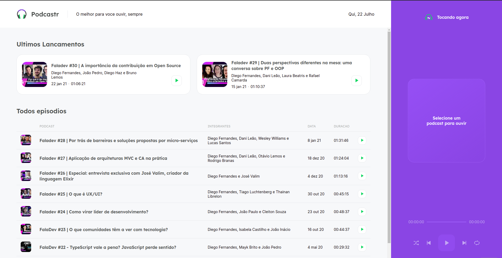

<h1 align="center">
    
</h1>

<div align="center">
    
</div>

## Technologies

This project was developed using the following technologies:

- [Next.js](https://nextjs.org/)
- [React](https://reactjs.org)
- [TypeScript](https://www.typescriptlang.org/)
- [Sass](https://sass-lang.com/)

## Getting started

Clone the project and access the folder

```bash
$ git clone git@github.com:andsonlourenco/podcastr.git && cd podcastr
```

Follow the steps below
```bash
# Install the dependencies
$ yarn

# Run the JSON server
$ yarn server

# Start the project
$ yarn dev
```

## Project

This is a project developed during the **[Next Level Week](https://nextlevelweek.com/)**, presented by **[@Rocketseat](https://github.com/Rocketseat)**.

## Layout

You can view the project layout through the links below:

- [Layout Web](https://www.figma.com/file/UwFEntsHpHYJlHNQAQr4gA/Podcastr?node-id=160%3A2761) 


## License

This project is licensed under the MIT License. See the [LICENSE](LICENSE.md) file for details.


---
